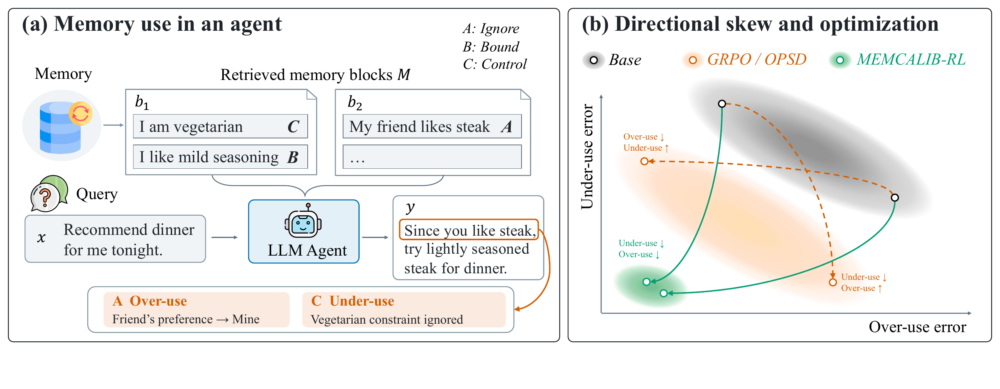
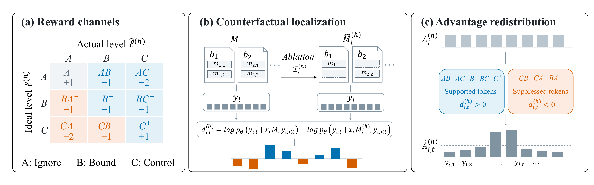

# MemCalib: Benchmarking and Optimizing Memory Use in LLM Agents

[Paper](https://arxiv.org/abs/2609.24259) · [Project Page](https://quark-medical.github.io/MemCalib-Project/) · [Dataset](https://huggingface.co/datasets/ZiLaotou/MemCalib)

Implementation of **MemCalib-RL** and data preparation tools for the **MemCalib** benchmark. MemCalib evaluates whether LLM agents use memory at the appropriate level. **MemCalib-RL** separates over-use and under-use signals and localizes their credit to response tokens through exact atom ablation.

<p align="center">
  
  <br>
  <sub>Memory use and optimization</sub>
</p>

<p align="center">
  
  <br>
  <sub>MemCalib-RL: ordered bidirectional counterfactual credit assignment</sub>
</p>

## Benchmark data

The benchmark covers health, general assistance, and coding. Each example contains a query, memory blocks, and atomic propositions annotated with ideal use levels and rubrics: **A (Ignore), B (Bound), C (Control)**.

Download `train.jsonl` and `test.jsonl` from [Hugging Face](https://huggingface.co/datasets/ZiLaotou/MemCalib). Save them in a directory of your choice and pass the training file path to `--input`.

| File | Examples | Purpose |
| --- | ---: | --- |
| `train.jsonl` | 13,500 | Training and development of memory-use optimization methods |
| `test.jsonl` | 1,500 | Held-out benchmark evaluation |

In the paper, 1,500 examples from the training set are held out for validation. The remaining 12,000 are used for the SFT baseline; subsequent RL experiments use a 4,000-example SFT cold start and 8,000 RL examples. The test set is separate from validation.

Choose your training and validation subsets from `train.jsonl`. Save **8,000 RL IDs** and **1,500 validation IDs** in two disjoint lists, one sample ID per line. Convert them to Parquet from the repository root:

```bash
python3 -m recipe.memcalib_credit.data \
    --input /path/to/train.jsonl \
    --rl-ids /path/to/rl.ids \
    --validation-ids /path/to/validation.ids \
    --rl-output /path/to/rl.parquet \
    --validation-output /path/to/validation.parquet
```

## Training

The method implementation and launchers are in [`recipe/memcalib_credit/`](recipe/memcalib_credit/). Set the model path to your SFT cold-start checkpoint.

Use separate environments for **Qwen3-8B / Ministral (FSDP + vLLM)** and **Qwen3.5 (Megatron + Bridge + SGLang)**. Their key package versions are listed below. [`recipe/memcalib_credit/requirements.txt`](recipe/memcalib_credit/requirements.txt) contains shared segmentation dependencies and additional environment versions in comments.

Run the commands below from the repository root, in the environment for your model. Set your paths and Judge API key, then configure the common options:

```bash
export DASHSCOPE_API_KEY="<your-api-key>"
export MEMCALIB_TRAIN_FILE="/path/to/rl.parquet"
export MEMCALIB_VAL_FILE="/path/to/validation.parquet"
export MEMCALIB_METHOD=fine_grained
export MEMCALIB_MERGE_A_OVERUSE=False
export MEMCALIB_LOCALIZATION_MODE=ordered_bidirectional
export MEMCALIB_LOCALIZATION_GRANULARITY=token
export MEMCALIB_PROMPT_BATCH_SIZE=64
export MEMCALIB_GROUP_SIZE=8
export MEMCALIB_PPO_MINI_BATCH_SIZE=32
export MEMCALIB_EPOCHS=1
```

The method options are:

| Variable | Choices |
| --- | --- |
| `MEMCALIB_METHOD` | `fine_grained` (MemCalib-RL), `grpo`, `gdpo` |
| `MEMCALIB_LOCALIZATION_MODE` | `ordered_bidirectional` (Ordered), `absolute_magnitude` (Absolute), `positive_only` (positive-only localization) |
| `MEMCALIB_LOCALIZATION_GRANULARITY` | `token`, `sentence` |
| `MEMCALIB_MERGE_A_OVERUSE` | `False` keeps all nine reward channels; `True` merges the A→B and A→C channels |

Localization options apply to `fine_grained`. The paper uses `ordered_bidirectional`, `token`, and nine channels; its localization ablations combine Ordered / Absolute signals with token / sentence granularity. GRPO and GDPO assign response-level advantages uniformly to tokens.

### Qwen3-8B

Full-parameter training with **FSDP + vLLM**.

**Environment (shared with Ministral):**

| Component | Version |
| --- | --- |
| Python | 3.12.3 |
| PyTorch | 2.11.0+cu130 |
| PyTorch CUDA build | 13.0 |
| Transformers | 5.6.1 |
| vLLM | 0.20.2 |
| FlashAttention | 2.8.3 |
| Ray | 2.55.1 |
| TensorDict / TorchData | 0.10.0 / 0.11.0 |
| TransferQueue | 0.1.7 |

Additional package versions are recorded in [`requirements.txt`](recipe/memcalib_credit/requirements.txt).

```bash
MEMCALIB_MODEL_PATH=/path/to/qwen3-8b-sft \
MEMCALIB_EXPERIMENT_NAME=qwen3-8b-example \
MEMCALIB_SAVE_DIR=/path/to/checkpoints/qwen3-8b \
MEMCALIB_OUTPUT_DIR=/path/to/outputs/qwen3-8b \
MEMCALIB_NNODES=1 MEMCALIB_GPUS_PER_NODE=8 \
MEMCALIB_LEARNING_RATE=1e-6 MEMCALIB_KL_COEF=0.01 \
bash recipe/memcalib_credit/run.sh \
    'credit.localization.eta={AB-:0.75,AC-:0.75,B+:0.75,B-:0.75,C+:0.75,C-:0.75,B0-:0.75,C0-:0.75}'
```

### Ministral-3-8B-Instruct

Full-parameter training with **FSDP + vLLM**.

**Environment:** same as [Qwen3-8B](#qwen3-8b), including the shared segmentation dependencies.

```bash
MEMCALIB_MODEL_PATH=/path/to/ministral-3-8b-sft \
MEMCALIB_EXPERIMENT_NAME=ministral-example \
MEMCALIB_SAVE_DIR=/path/to/checkpoints/ministral \
MEMCALIB_OUTPUT_DIR=/path/to/outputs/ministral \
MEMCALIB_NNODES=1 MEMCALIB_GPUS_PER_NODE=8 \
MEMCALIB_LEARNING_RATE=1e-6 MEMCALIB_KL_COEF=0.01 \
bash recipe/memcalib_credit/run_ministral.sh \
    'credit.localization.eta={AB-:0.75,AC-:0.75,B+:0.75,B-:0.75,C+:0.75,C-:0.75,B0-:0.75,C0-:0.75}'
```

### Qwen3.5-35B-A3B

Rank-64 LoRA training with **Megatron + Bridge + SGLang**.

**Environment:**

| Component | Version |
| --- | --- |
| Python | 3.12.3 |
| PyTorch | 2.11.0+cu130 |
| PyTorch CUDA build | 13.0 |
| Transformers | 5.3.0 |
| SGLang | 0.5.12 |
| Megatron Core | 0.19.0 |
| Megatron Bridge | 0.6.0 |
| Transformer Engine | 2.15.0 |
| FlashAttention | 2.8.3 |
| Flash Linear Attention | 0.4.1 |
| Ray | 2.55.1 |
| TensorDict / TorchData | 0.10.0 / 0.11.0 |
| TransferQueue | 0.1.7 |

Shared segmentation dependencies and additional package versions are listed in [`requirements.txt`](recipe/memcalib_credit/requirements.txt).

This example uses two nodes with eight GPUs each, actor TP=2 / EP=8, and rollout TP=4. Start the Ray cluster and run the command on the head node. Adjust these parallelism settings if you change the GPU layout.

```bash
MEMCALIB_MODEL_PATH=/path/to/qwen3.5-35b-a3b-sft \
MEMCALIB_EXPERIMENT_NAME=qwen3.5-example \
MEMCALIB_SAVE_DIR=/path/to/checkpoints/qwen3.5 \
MEMCALIB_OUTPUT_DIR=/path/to/outputs/qwen3.5 \
MEMCALIB_NNODES=2 MEMCALIB_GPUS_PER_NODE=8 \
MEMCALIB_LEARNING_RATE=5e-6 MEMCALIB_KL_COEF=0.01 \
bash recipe/memcalib_credit/run_qwen3_5_lora.sh \
    'credit.localization.eta={AB-:0.75,AC-:0.75,B+:0.75,B-:0.75,C+:0.75,C-:0.75,B0-:0.75,C0-:0.75}'
```

## Citation

```bibtex
@misc{cao2026memcalib,
  title = {MemCalib: Benchmarking and Optimizing Memory Use in LLM Agents},
  author = {Ruike Cao and Fanyu Zhao and Fugen Yao and Liang Dong and
            Jian Xu and Guanjun Jiang and Yifei Zhao and Han Zhang and Li Xiao},
  year = {2026},
  eprint = {2609.24259},
  archivePrefix = {arXiv},
  primaryClass = {cs.LG},
  url = {https://arxiv.org/abs/2609.24259}
}
```

## Acknowledgments

This implementation builds on [verl](https://github.com/verl-project/verl), based on commit [`7aed6b230776f963fa09509c10d9c3a767d1102c`](https://github.com/verl-project/verl/commit/7aed6b230776f963fa09509c10d9c3a767d1102c). The upstream license and attribution are retained in [LICENSE](LICENSE) and the source files.
